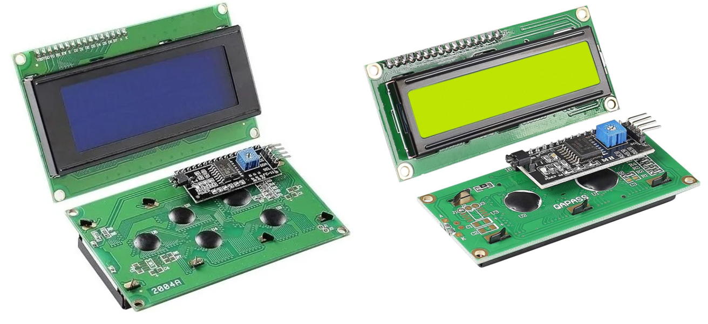

# 📟 STM32 I2C Driver for HD44780 LCD



> **📦 Description:** A robust and efficient STM32 HAL driver for HD44780-based LCDs over I2C using a PCF8574 expander. This project provides support for 16x2 and 20x4 LCD displays, including large character rendering and flexible configuration for embedded C applications.

This library minimizes the use of GPIOs by controlling the LCD via I2C, allowing seamless integration with STM32 microcontrollers and the HAL framework.

## 🚀 Features

- Supports 16x2 and 20x4 character LCDs.
- HAL-compatible STM32 driver.
- Uses PCF8574 or similar I/O expanders over I2C.
- Supports backlight, cursor, and blink control.
- Allows big font rendering using custom characters.
- Compatible with STM32CubeMX and STM32CubeIDE.
- Easily configurable communication mode (blocking, interrupt, or DMA).

## 📁 Project Structure

```
├── LCD_I2C_STM32_FINAL_A/
│   ├── lcd_Hd44780I2C.h
│   └── bigFont_lcdI2c.h
│   ├── lcd_Hd44780I2C.c
│   └── bigFont_lcdI2c.c
├── LCD_I2C_STM32_FINAL_B/
│   ├── lcd_Hd44780I2C.h
│   └── bigFont_lcdI2c.h
│   ├── lcd_Hd44780I2C.c
│   └── bigFont_lcdI2c.c
├── Images/
│   └── LCD_20x4_16x2.png
│   └── LCD_20x4_Test.pn
├── README.md
└── LICENSE
```

## 🛠️ Requirements

- STM32CubeMX and STM32CubeIDE.
- STM32 HAL library configured for I2C.
- PCF8574 I/O expander connected to the HD44780 LCD.

## ⚙️ Setup

1. Connect your LCD through the PCF8574 i2c expander to your mcu, i´ve used the blue pill.
	- https://wiki.liutyi.info/display/ARDUINO/LCD+2004A+i2c+PCF8574T
	- https://wiki.relativty.net/index.php/STM32
2. Configure the I2C peripheral in STM32CubeMX or the STM32CubeIDE.

> ⚠️ **Warning:** It is recommended to use the external clock, as it is more accurate and ensures the proper functioning of the library. To avoid errors, the clock frequency must be equal to or greater than 16 MHz.

> ℹ️ **Info:** If you've enabled additional I2C features such as DMA or other functionalities that interact with I2C, you'll need to select the I2C transfer mode that best suits your needs in the lcd_Hd44780I2C.h file.

```c
//options
//#define LCD_I2C_USE_DMA_TRANSFER
//#define LCD_I2C_USE_IT_TRANSFER
#define LCD_I2C_USE_BLOCK_TRANSFER
```
3. Include `lcd_Hd44780I2C.c`, `bigFont_lcdI2c.h`, `bigFont_lcdI2c.c`  and `lcd_Hd44780I2C.h` in your project.
4. Define the correct I2C address for your PCF8574 (commonly 0x4E ).
5. Initialize the LCD in your main application code.
6. Try to inlude this example in your own `main.c` file to test it.

> 💡 **Tip:** This library supports connecting up to 7 I2C displays on the same I2C bus. Ensure that each display has a unique I2C address to prevent communication conflicts.

## 💡 Example Usage

```c
#include <bigFont_lcdI2c.h>
#include <lcd_Hd44780I2C.h>

#define LCD_ROWS		(4U)
#define LCD_COLS		(20U)
#define LCD_I2C_ADDRESS	(0x4E)
	
/* Number to print in the LCD */
static uint32_t number = 956;
/* Lcd object */
static LCD_t Lcd;
/*Lcd configuration */
static const LCD_cfg_t Lcd_Hd44780I2cCfg =
{
    &hi2c2,   /* Depending on your active I2C configuration */
    LCD_COLS, /* Lcd columns */
    LCD_ROWS, /* Lcd rows */
    LCD_I2C_ADDRESS, /* Lcd address. Depending on your PCF8574T expander board it could change. */
    LCD_5x8DOTS /* Pending to remove, here you can set 0*/
};

int main(void)
{
    LCD_init(&Lcd, &Lcd_Hd44780I2cCfg); /* Initialize the LCD to print "normal characters"*/
    LCD_setBacklight(&Lcd, 1u);/* Turn on the Backlight */
    BIGFONT_init(&Lcd); /*Initialize Big font characters */
    BIGFONT_printMsg(&Lcd,"Hello", 0, 0);
    LCD_setCursor(&Lcd, 0, 3);
    LCD_print(&Lcd, "Number: %d", number);

}
```
## 🖼️ Demonstration


## 📚 References

This library was based on the the following references:

- [STM32 HAL Documentation](https://deepbluembedded.com/stm32-hal-library-tutorial-examples/)
- [HD44780 LCD Controller Datasheet](https://academy.cba.mit.edu/classes/output_devices/44780.pdf)
- [PCF8574 I/O Expander Datasheet](https://www.nxp.com/docs/en/data-sheet/PCF8574_PCF8574A.pdf)
- https://liudr.wordpress.com/libraries/phi_big_font/
- https://github.com/johnrickman/LiquidCrystal_I2C
- [I2C Communication Protocol Overview](https://www.i2c-bus.org)

## 🔖 Keywords

- STM32
- HD44780
- LCD
- I2C
- PCF8574
- HAL
- Embedded C
- STM32CubeMX
- STM32CubeIDE
- Microcontroller Display Driver

## 📄 License
This project is licensed under the GPL V3 License.

## 🤝 Contributing
Contributions are welcome! Please open an issue or submit a pull request to enhance this project.